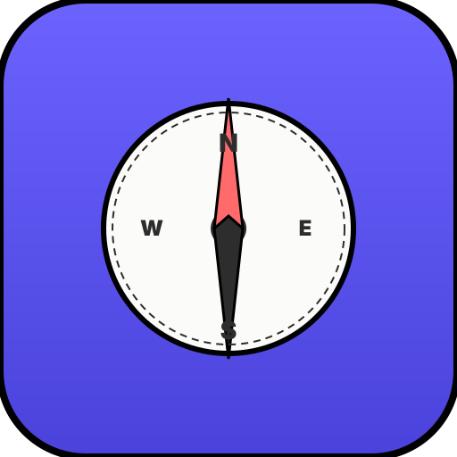
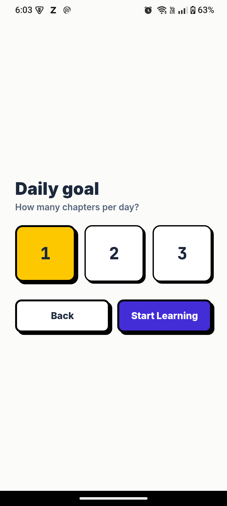
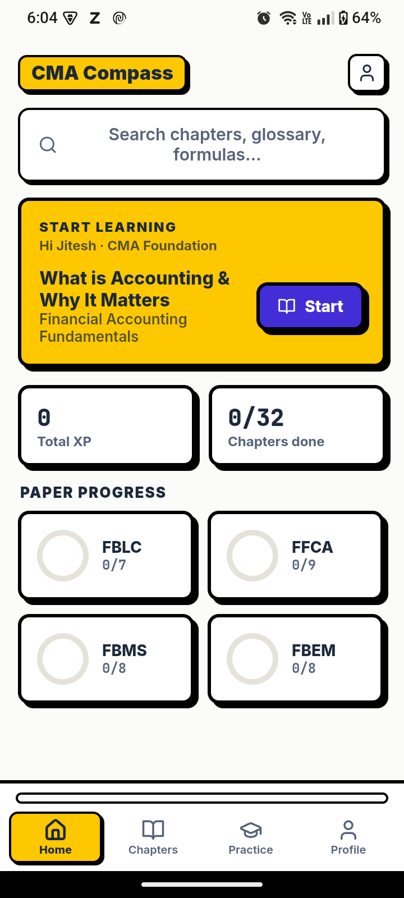
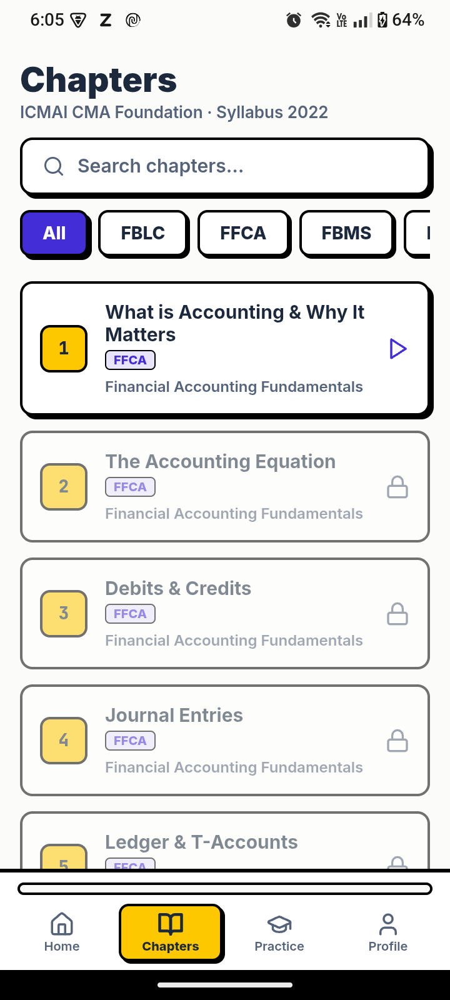
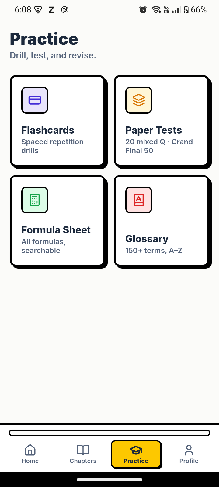

<div align="center">
  
  <h1>CMA Compass</h1>
  <p><strong>Crack the CMA exam. One chapter at a time.</strong></p>
  <p>A free, open-source Android app for CMA (Certified Management Accountant) students preparing for ICMAI's Foundation, Intermediate, and Final exams under the 2022 syllabus.</p>
</div>

---

## Screenshots

| Home Dashboard | Chapters |
|---|---|
|  |  |

| Chapter Detail | Practice |
|---|---|
|  |  |

---

## The Problem

CMA students in India face a fragmented study experience:

- **Scattered resources** — YouTube lectures are spread across dozens of channels (Akash Agarwal Classes, CMA Saarthi, JKSC CMA Surat, Unique Academy, CA Raj K Agrawal, etc.). Students waste time hunting for the right video for each chapter.
- **No structured curriculum** — The syllabus has 12+ papers across 3 levels. Without a guided path, students miss chapters or study out of order.
- **No progress tracking** — It's hard to know which chapters are done, which quizzes are passed, and how much you've actually studied.
- **No unified practice** — Quizzes, flashcards, and PDF summaries live in different apps or websites. There's no single hub.

## What CMA Compass Solves

| Problem | Solution |
|---|---|
| Fragmented video sources | Curated, verified YouTube playlists per paper + specific lecture options per chapter (full lecture, quick revision, worked examples). Every video ID is live-checked. |
| No structured syllabus | Full Foundation (Papers 1–4), Intermediate (Papers 5–12), and Final (Papers 13–20) syllabus mapped chapter-by-chapter with sections, key points, and XP rewards. |
| No progress tracking | Built-in progress store (video watched, quiz passed, XP earned, bookmarks). Chapters unlock sequentially. |
| No unified practice | Each chapter has a 10-question MCQ quiz, a flashcard stack, and linked PDF summaries/practice sheets — all in one screen. |
| App updates are painful | OTA update system downloads `web-build.zip` from GitHub Releases and extracts it at runtime — no APK reinstall needed. Falls back to APK if OTA fails. |
| Boring UI | Neobrutalism design — flat colors, 2–3px black borders, hard offset box shadows, JetBrains Mono + Inter. Fun to use. |

---

## Features

### Onboarding
- Personalized welcome with name input
- Level selection (Foundation / Intermediate / Final)
- Daily study goal setting (1–3 chapters per day)
- Clean, guided first-run experience

### Home Dashboard
- **"Continue Learning"** card — jump straight back into your current chapter
- **XP counter** — see your total experience points at a glance
- **Streak tracker** — maintain your daily study streak
- **Paper progress** — circular progress rings for each paper (FBLC, FFCA, FBMS, FBEM, etc.)
- **Search bar** — search chapters, glossary terms, and formulas instantly

### Chapter System
- **Sequential unlocking** — chapters unlock as you complete previous ones
- **Video lectures** — embedded YouTube player with curated CMA-specific lectures
- **Overview tab** — key points, XP reward, paper/section info
- **Quiz tab** — 10-question MCQ quiz (unlocks after watching the lecture)
- **Flashcards tab** — chapter-wise flashcards with term/definition flip
- **PDF tab** — in-app PDF reader with Summary, Practice Problems, and Cheat Sheet

### Practice Hub
- **Flashcards** — spaced repetition drills across all chapters
- **Paper Tests** — 20 mixed questions from a paper, Grand Final with 50 questions
- **Formula Sheet** — all formulas, searchable
- **Glossary** — 150+ CMA terms, A–Z

### Profile & Badges
- **XP progress bar** — track your level progression (Beginner → Expert)
- **Day streak** — consecutive study days
- **Chapters completed** — total chapters done out of all available
- **12 badges** — First Step, On Fire (7-day streak), Perfectionist (10/10 quiz), CMA Foundation, CMA Final, Speed Run, and more
- **Theme switcher** — choose from Neobrutalism, Glassmorphism, Claymorphism, Neumorphism, Skeuomorphism, Vaporwave, and Cyberpunk themes

### OTA Updates
- In-app update checker queries GitHub Releases
- Downloads `web-build.zip` and extracts to device storage
- No APK reinstall needed — reloads the WebView from the new bundle
- Falls back to APK download if OTA fails

---

## Papers Covered

### CMA Foundation (Papers 1–4)

| Paper | Code | Subjects |
|---|---|---|
| 1. Fundamentals of Business Laws & Communication | FBLC | Business Laws, Business Communication |
| 2. Fundamentals of Financial Accounting | FFCA | Financial Accounting Fundamentals |
| 3. Fundamentals of Business Mathematics & Statistics | FBMS | Mathematics, Statistics |
| 4. Fundamentals of Business Economics & Management | FBEM | Business Economics, Management |

### CMA Intermediate (Papers 5–12)

| Paper | Code | Group |
|---|---|---|
| 5. Financial Accounting | FA | Group I |
| 6. Laws & Ethics | LE | Group I |
| 7. Direct & Indirect Taxation | DT | Group I |
| 8. Cost Accounting | CA | Group I |
| 9. Operations Management & Strategic Management | OMSM | Group II |
| 10. Corporate Accounting & Auditing | CAA | Group II |
| 11. Financial Management & Business Data Analytics | FMDA | Group II |
| 12. Management Accounting | MA | Group II |

### CMA Final (Papers 13–20)

| Paper | Code | Group |
|---|---|---|
| 13. Corporate & Economic Laws | CEL | Group I |
| 14. Strategic Cost Management | SCM | Group I |
| 15. Direct Tax Laws & International Taxation | DTL | Group I |
| 16. Financial Analysis & Business Valuation | FABV | Group I |
| 17. Corporate Financial Reporting | CFR | Group II |
| 18. Strategic Financial Management | SFM | Group II |
| 19. Direct & Indirect Tax Laws & Practice | DITP | Group II |
| 20. Strategic Performance Management & Business Valuation | SPM | Group II |

---

## Architecture

```
┌─────────────────────────────────────────────┐
│           Capacitor WebView (Android)        │
│  ┌─────────────────────────────────────────┐ │
│  │         React 18 + TypeScript           │ │
│  │  ┌───────┐ ┌────────┐ ┌─────────────┐  │ │
│  │  │Router │ │ Zustand│ │  Framer      │  │ │
│  │  │(react-│ │ (store)│ │  Motion      │  │ │
│  │  │router)│ │        │ │  (animations)│  │ │
│  │  └───────┘ └────────┘ └─────────────┘  │ │
│  │  ┌────────────────────────────────────┐ │ │
│  │  │  Screens + Components              │ │ │
│  │  │  ChapterDetail, QuizOverlay,       │ │ │
│  │  │  FlashcardStack, PdfTab,           │ │ │
│  │  │  PracticeSession, Loader           │ │ │
│  │  └────────────────────────────────────┘ │ │
│  │  ┌────────────────────────────────────┐ │ │
│  │  │  Data Layer                        │ │ │
│  │  │  curriculum.ts, videos.ts,         │ │ │
│  │  │  chapters_final.ts, pastPapers.ts  │ │ │
│  │  │  studyMaterial.ts, themes.ts       │ │ │
│  │  └────────────────────────────────────┘ │ │
│  └─────────────────────────────────────────┘ │
│  ┌─────────────────────────────────────────┐ │
│  │  Native Plugins (Java)                  │ │
│  │  OtaUpdaterPlugin, ApkUpdaterPlugin     │ │
│  └─────────────────────────────────────────┘ │
└─────────────────────────────────────────────┘
```

## Tech Stack

| Layer | Technology |
|---|---|
| UI Framework | React 18, TypeScript |
| Styling | Tailwind CSS, inline styles |
| Animations | Framer Motion 11 |
| Routing | react-router-dom 6 |
| State Management | Zustand 5 |
| Bundler | Vite 5 |
| Mobile Runtime | Capacitor 6 (Android) |
| Database | @capacitor-community/sqlite |
| PDF Viewer | pdfjs-dist 4.4 |
| PDF Generation | jsPDF 2.5 |
| Icons | lucide-react |
| CI/CD | GitHub Actions |

---

## Setup & Development

### Prerequisites

- Node.js 18+
- npm 9+
- Android Studio (for building/running on device or emulator)
- A physical Android device or emulator (API 24+)

### 1. Clone & Install

```bash
git clone https://github.com/jiteshoffice1234-star/cma-compass.git
cd cma-compass
npm install
```

### 2. Development (Web)

```bash
npm run dev
```

Opens at `http://localhost:5173`. Most UI work can be done in the browser — the app uses responsive layouts that match the mobile view.

### 3. TypeScript Check & Build

```bash
npm run build
```

Runs `tsc` (type checking) followed by `vite build` (production bundle). Output goes to `dist/`.

### 4. Run on Android

```bash
npx cap sync android      # copy web build to Android project
npx cap open android      # open in Android Studio
```

Then build and run from Android Studio (or use `npx cap run android` if a device is connected).

### 5. Sync After Code Changes

After changing web code, rebuild and sync:

```bash
npm run build && npx cap sync android
```

---

## How OTA Updates Work

1. **GitHub Actions** builds the web app and packages `dist/` into `web-build.zip`
2. Both `cma-compass-vX.X.X.apk` and `web-build.zip` are uploaded as release assets
3. On app launch, `UpdatePopup.tsx` calls the GitHub Releases API to check for a newer version
4. If found, the user sees an update prompt:
   - **Install OTA** (default) — downloads `web-build.zip`, extracts to `filesDir/ota/{version}/`, writes version to `SharedPreferences`, and reloads the WebView from the new directory
   - **Download APK** — fallback; downloads the APK and triggers Android's package installer
5. On next app cold start, `MainActivity.java` reads `SharedPreferences` and loads the OTA directory if one is active

---

## Project Structure

```
cma-compass/
├── .github/workflows/
│   └── build-apk.yml          # CI: build APK + web-build.zip, create release
├── android/
│   └── app/src/main/java/com/accountiq/app/
│       ├── MainActivity.java   # App entry, OTA dir detection
│       ├── OtaUpdaterPlugin.java  # Native OTA update plugin
│       └── ApkUpdaterPlugin.java  # Native APK download/install plugin
├── assets/
│   ├── icon.svg                # App icon (compass SVG)
│   └── screenshots/            # Real app screenshots (PNG)
├── src/
│   ├── components/
│   │   ├── ui.tsx              # Reusable: Tappable, Card, Button, IconButton, etc.
│   │   ├── QuizOverlay.tsx     # Quiz overlay for chapters
│   │   ├── FlashcardStack.tsx  # Chapter flashcards
│   │   ├── UpdatePopup.tsx     # OTA/APK update prompt
│   │   ├── Loader.tsx          # Custom loading animation
│   │   └── PracticeSession.tsx # Practice test session
│   ├── data/
│   │   ├── curriculum.ts       # Chapters, papers, level definitions, playlists
│   │   ├── videos.ts           # ChapterVideo[] per chapter
│   │   ├── chapters.ts         # Chapter data (Foundation core)
│   │   ├── chapters_found_extra.ts  # Extra Foundation chapters
│   │   ├── chapters_inter_a.ts # Intermediate Group I chapters
│   │   ├── chapters_inter_b.ts # Intermediate Group II chapters
│   │   ├── chapters_final.ts   # Final level chapters
│   │   ├── questions.ts        # Foundation/Intermediate quiz questions
│   │   ├── questions_final.ts  # Final level quiz questions
│   │   ├── pastPapers.ts       # Past exam papers data
│   │   └── studyMaterial.ts    # Official ICMAI study material PDFs
│   ├── lib/
│   │   ├── otaUpdater.ts       # TypeScript bridge for OtaUpdaterPlugin
│   │   ├── updateChecker.ts    # GitHub API version check
│   │   ├── themes.ts           # Theme definitions (7 themes)
│   │   └── levels.ts           # Level management
│   ├── screens/
│   │   ├── Onboarding.tsx      # First-run onboarding flow
│   │   ├── ChapterDetail.tsx   # Chapter screen: video + tabs
│   │   ├── Chapters.tsx        # Chapter listing screen
│   │   ├── Home.tsx            # Home dashboard
│   │   ├── PaperScreen.tsx     # Paper listing with chapters
│   │   ├── LevelScreen.tsx     # Level selection
│   │   ├── StageTestOverlay.tsx # Paper-level mock test overlay
│   │   └── PdfTab.tsx          # In-app PDF reader
│   ├── store/
│   │   └── index.ts            # Zustand store (progress, bookmarks, etc.)
│   ├── theme.ts                # Design tokens (neobrutalism)
│   └── index.css               # Global styles, theme CSS variables
├── index.html
├── package.json
├── capacitor.config.ts
├── tsconfig.json
├── vite.config.ts
├── tailwind.config.js
├── postcss.config.js
├── PRIVACY.md                  # Privacy Policy
├── TERMS.md                    # Terms of Service
└── README.md                   # This file
```

---

## Releases

Each GitHub Release includes two assets:

- **`cma-compass-vX.X.X.apk`** — Standalone Android APK. Download and install on any Android device (API 24+).
- **`web-build.zip`** — OTA update bundle for in-app updates without reinstalling.

[View all releases →](https://github.com/jiteshoffice1234-star/cma-compass/releases)

---

## Contributing

This is a personal project. If you have suggestions or find broken video links, open an issue.

---

## Legal

- **[Privacy Policy](PRIVACY.md)** — CMA Compass does not collect, store, or transmit any personal data. All progress is stored locally on your device.
- **[Terms of Service](TERMS.md)** — The App is provided "as is" for self-study purposes. No affiliation with ICMAI.
- **ICMAI** — The CMA name and syllabus are the property of the Institute of Cost Accountants of India. This app is not affiliated with or endorsed by ICMAI.

---

## License

MIT License — See [LICENSE](LICENSE) for details.

You are free to:
- ✅ Use this project for any purpose
- ✅ Modify and create derivatives
- ✅ Distribute copies
- ✅ Use for commercial purposes

Just include the license notice.

### Copyright & Attribution

**CMA Compass © 2026 Jitesh**

**Important Legal Notice:**
- This app is **NOT affiliated with ICMAI** (Institute of Cost Accountants of India)
- The CMA name and syllabus are ICMAI's property
- This is an independent study tool referencing the public CMA curriculum
